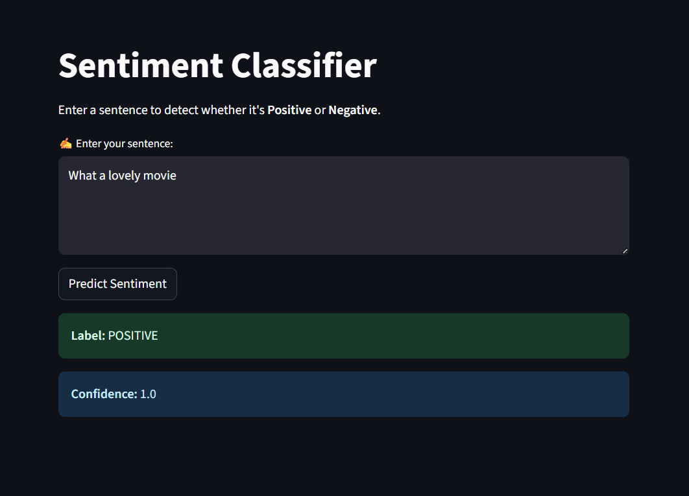

# 🧠 Sentiment Analysis App (DistilBERT + Streamlit)

A production-ready **sentiment classification web app** built using HuggingFace Transformers and Streamlit.  
It classifies text as **positive** or **negative** using a pre-trained transformer model.

---

## 🚀 Features

- ✅ Uses `distilbert-base-uncased-finetuned-sst-2-english`
- ✅ HuggingFace pipeline — no training required
- ✅ Streamlit frontend — easy to use and deploy
- ✅ Hosted on Streamlit Cloud (free)
- ✅ Jupyter-tested with IMDb reviews

---

## 🧪 Model

- **Model**: DistilBERT (fine-tuned on SST-2 for sentiment)
- **Source**: `distilbert-base-uncased-finetuned-sst-2-english`
- **Accuracy**: ~92% on test samples
- **Inference Time**: < 1s per text

---

## 🧾 Example Usage

### 🔗 App URL

🌐 [Live App](https://sentiment-analysis-14.streamlit.app)

### ✅ Input

Type your sentence into the text area and click "Predict Sentiment".

### 📤 Output

- Label: `POSITIVE` or `NEGATIVE`
- Confidence Score: e.g. `0.998`

---

## 📦 Local Setup

```bash
# 1. Install dependencies
pip install -r requirements.txt

# 2. Run the Streamlit app
streamlit run app.py
```

The app will be available at:  
📍 `http://localhost:8501`

---

## 📁 Project Structure

```
sentiment-streamlit/
├── app.py                  # Streamlit app
├── requirements.txt
├── README.md
├── test.ipynb              # Jupyter notebook with analysis
└── screenshots/
    └── sentiment_demo.png
```

---

## 🧠 HuggingFace Usage

Model is loaded via pipeline:

```python
from transformers import pipeline
classifier = pipeline("sentiment-analysis")
classifier("This is great!")
# → {'label': 'POSITIVE', 'score': 0.99}
```

---

## 📸 Demo Screenshot



---

## 📌 Author

[https://github.com/chandanabhargav](https://github.com/chandanabhargav)
